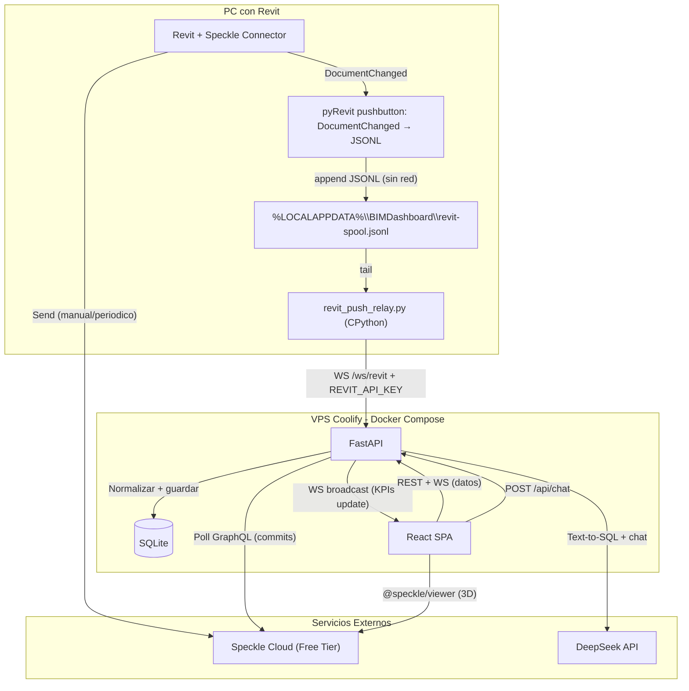

# Architecture

Mapa tecnico del proyecto. El estilo de codigo y las prohibiciones estan en `.cursor/rules/`.

## Stack y producto

- **Stack:** [`AGENTS.md` §2](../AGENTS.md#2-stack-del-proyecto)
- **Producto / dominio:** [`AGENTS.md` §3](../AGENTS.md#3-contexto-de-negocio)

## Patron

- **Arquitectura:** Clean Architecture (Domain isolated from Infrastructure)
- **Principio rector:** Separation of Concerns — dominio aislado de infraestructura. Los casos de uso orquestan entidades del dominio y dependen de interfaces (puertos), no de implementaciones concretas.

## Estructura de carpetas

```
data-speckle/
├── .cursor/rules/                    # Reglas de Cursor AI (globs actualizados)
├── docs/                             # Documentacion (SSOT en AGENTS.md)
│   ├── architecture.md               # Este archivo
│   ├── decisions.md                  # ADRs
│   ├── onboarding.md                 # Setup local
│   └── prompts/                      # Prompts paso a paso para desarrollo
│       ├── 01-fundacion.md
│       ├── 02-dominio-db.md
│       ├── 03-auth.md
│       ├── 04-ingesta-datos.md
│       ├── 05-api-rest.md
│       ├── 06-websockets.md
│       ├── 07-pyrevit-push.md
│       ├── 08-frontend-init.md
│       ├── 09-dashboard-kpis.md
│       ├── 10-viewer-3d.md
│       ├── 11-ia-chat.md
│       └── 12-deploy.md
├── apps/
│   ├── api/                          # Backend FastAPI
│   │   ├── src/
│   │   │   ├── domain/               # Entidades: Element, ParameterSnapshot, QcFinding
│   │   │   ├── application/          # Casos de uso: IngestCommit, GetKpis, ChatQuery
│   │   │   ├── infrastructure/
│   │   │   │   ├── db/               # SQLAlchemy models, session, repos
│   │   │   │   ├── speckle/          # Cliente GraphQL Speckle
│   │   │   │   ├── llm/              # Cliente DeepSeek
│   │   │   │   └── auth/             # JWT utils
│   │   │   └── api/                  # Handlers HTTP + WebSocket
│   │   │       ├── routes/           # elements, auth, chat, ws
│   │   │       ├── deps.py           # Dependency injection
│   │   │       └── main.py           # Entry point
│   │   ├── scripts/
│   │   │   ├── revit_push/           # Fuente pyRevit (copiar a la extension)
│   │   │   ├── revit_push_relay.py   # CPython: spool JSONL → /ws/revit
│   │   │   ├── probe_revit_ws.py
│   │   │   └── probe_speckle.py
│   │   ├── tests/
│   │   ├── requirements.txt
│   │   ├── Dockerfile
│   │   └── pyproject.toml
│   └── web/                          # Frontend React + Vite
│       ├── src/
│       │   ├── components/           # Charts, DataTable, SpeckleViewer + toolbars
│       │   ├── hooks/                # useWebSocket, useElements, useAuth
│       │   ├── lib/
│       │   │   ├── api.ts            # Cliente HTTP centralizado
│       │   │   └── speckle.ts        # Adapter @speckle/viewer (load, select, tools)
│       │   ├── pages/                # Login, Dashboard
│       │   ├── App.tsx
│       │   └── main.tsx
│       ├── public/
│       ├── index.html
│       ├── package.json
│       ├── vite.config.ts
│       ├── tailwind.config.ts
│       ├── tsconfig.json
│       └── Dockerfile
├── docker-compose.yml
├── .env.example
├── AGENTS.md                         # SSOT: stack, negocio, alcance
├── README.md
└── .gitignore
```

## Capas (Clean Architecture)

| Capa | Ubicacion | Responsabilidad |
|------|-----------|-----------------|
| Domain | `apps/api/src/domain/` | Entidades Pydantic/SQLAlchemy puras. Validaciones del modelo BIM. Sin dependencias externas. |
| Application | `apps/api/src/application/` | Casos de uso: IngestCommit, GetKpis, RunQcCheck, ChatQuery. Orquestan entidades via puertos (interfaces). |
| Infrastructure | `apps/api/src/infrastructure/` | Adaptadores concretos: SQLAlchemy repos, Speckle GraphQL client, DeepSeek HTTP client, JWT utils. |
| API (Interface Adapters) | `apps/api/src/api/` | Handlers HTTP (FastAPI routes) y WebSocket endpoints. Convierten DTOs ↔ entidades. |
| Presentation | `apps/web/src/` | React + Vite. Componentes presentacionales + hooks. Shell responsive: sidebar fijo en `lg+`, drawer hamburguesa en `<lg`. Consume API REST + WebSocket + Speckle Viewer. |

## Flujo Revit → API → Dashboard



### Detalle de los flujos

1. **Ingesta via Speckle (historial + 3D):**
   - Usuario hace Send desde Revit al stream de Speckle.
   - FastAPI hace polling periodico del ultimo commit via GraphQL (o recibe webhook).
   - El caso de uso `IngestCommit` aplana el arbol de objetos Speckle a filas de SQLite (element_id, category, level, params...).
   - El frontend carga el viewer `@speckle/viewer` apuntando al commit del branch configurado (`SPECKLE_BRANCH_NAME` via `/api/speckle/viewer-config`).
   - Controles propios (no la UI de Speckle Cloud): toolbar inferior (zoom extents, medir, sección) y menú cámara superior-derecha (vistas canónicas, ortográfico, free orbit, fullscreen). Atajos: `Alt+1..5`, `Shift+P`. Ghost filters / panel Info quedan fuera del MVP.

2. **Tiempo real via pyRevit + relay (metricas KPIs) — ADR-010:**
   - El pushbutton (IronPython, `engine.persistent`) registra `DocumentChanged` con delegate fuerte en `AppDomain` (primer clic ON).
   - Cada cambio se escribe al acto en el spool JSONL (sin sockets, sin hilos). ON/OFF solo pausa el writer; icono `on.png`/`off.png`.
   - `revit_push_relay.py` (CPython, venv del API) hace tail del spool, autentica con `REVIT_API_KEY` y empuja a `/ws/revit`.
   - FastAPI upserta en SQLite (`source=revit_ws`) y hace broadcast a `/ws/dashboard`.
   - **Por que no WS directo desde Revit:** hilos / ClientWebSocket / CPython dentro de Revit 2027+ crashean el host.

3. **Consultas NL (IA):**
   - Usuario escribe en el panel de chat del dashboard.
   - `POST /api/chat` recibe la pregunta y la envia a DeepSeek con el esquema de la BD documentado en el prompt.
   - DeepSeek genera SQL/Pandas valido (con allowlist de tablas/columnas).
   - FastAPI ejecuta la consulta, devuelve resultados + IDs de elementos.
   - El frontend resalta los elementos en la tabla y en el visor 3D.

## Deploy (Docker Compose)

- **API:** `apps/api/Dockerfile` — Alembic en entrypoint, uvicorn 1 worker, `--proxy-headers`, SQLite en volumen `/data`.
- **Web:** `apps/web/Dockerfile` — build Vite + nginx (`apps/web/nginx.conf`) con proxy same-origin de `/api`, `/ws`, `/health`.
- **Compose:** `docker-compose.yml` (Coolify). Local: añadir `-f docker-compose.local.yml` para montar `.env` (no usar `env_file` de Compose con hashes bcrypt: el `$` corrompe el login).
- **Arranque local verificado:** `docker compose --env-file .env.compose -f docker-compose.yml -f docker-compose.local.yml up --build` → `/health` 200, login guest, WS 101.

## Contrato de error de API

Todas las respuestas de error siguen el formato:

```json
{
  "success": false,
  "error": "Mensaje claro del error",
  "detail": "Opcional: stack trace o info adicional en desarrollo"
}
```

HTTP status codes: 400 (validacion), 401 (auth), 404 (no encontrado), 500 (interno).

## Decisiones abiertas

Al cerrar una decision: `[x] → ADR-NNN` y registrar el ADR en [`docs/decisions.md`](./decisions.md).

- [x] Contratos de API versionados: no — MVP sin versionado explicito.
- [x] Auth: JWT admin/guest/guest_extended (ADR-005 + ADR-011); writes requieren `admin`.
- [x] Limites de responsabilidad FE vs BE: API normaliza y sirve datos; frontend renderiza y conecta viewer. Sin logica de negocio en el frontend.

Decisiones ya tomadas → [`docs/decisions.md`](./decisions.md).